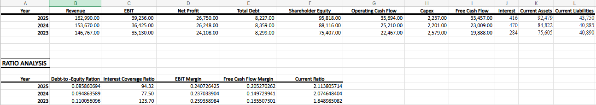
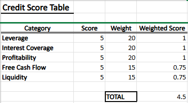
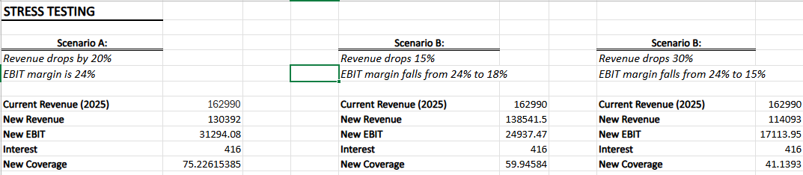

# Credit Risk Assessment & Scoring Model

## Project Overview

- Evaluated the creditworthiness of Infosys under an assumed ₹200 Crore term loan exposure  
- Built a structured financial risk evaluation framework  
- Converted financial ratios into a weighted scoring model  
- Performed stress testing under adverse revenue scenarios  
- Arrived at a formal credit recommendation  

---

## Financial Analysis (3-Year Review)

- Analyzed Revenue, EBIT, Net Profit, Debt, Equity, and Cash Flow  
- Calculated Debt-to-Equity ratio to assess capital structure  
- Evaluated Interest Coverage to measure debt servicing ability  
- Assessed EBIT Margin for operating performance stability  
- Measured Free Cash Flow margin for repayment capacity  
- Reviewed Current Ratio for short-term liquidity strength  

---

## Key Financial Indicators (FY2025)

- Debt-to-Equity: 0.085 (Very low leverage)  
- Interest Coverage: 94x (Strong earnings cushion)  
- EBIT Margin: ~24% (Stable operating performance)  
- Free Cash Flow Margin: ~20% (Strong cash conversion)  
- Current Ratio: 2.11 (Comfortable liquidity position)  

---
## Model Preview

### Ratio Calculation Sheet

### Credit Scoring Sheet

### Stress Testing Sheet

## Credit Scoring Model

- Assigned scores (1–5) based on predefined risk thresholds  
- Applied weights to reflect importance of each risk factor  
- Risk categories included:
  - Leverage  
  - Interest Coverage  
  - Profitability  
  - Cash Flow Strength  
  - Liquidity  

- Final Weighted Score: 4.5 / 5  
- Risk Classification: Low Credit Risk  

---

## Stress Testing

- Simulated 20% revenue decline  
- Simulated margin compression scenario  
- Simulated severe stress case (30% revenue drop)  
- Recalculated interest coverage under each scenario  
- Observed strong resilience even under aggressive assumptions  

---

## Qualitative Risk Considerations

- Exposure to global IT spending cycles  
- Dependence on US and European markets  
- Client concentration risk  
- Currency sensitivity  
- Governance and business model stability  

---

## Model Limitations

- Based on historical financial data  
- Does not include probability of default modeling  
- Assumes constant interest expense during stress scenarios  
- Intended for academic demonstration of credit assessment framework  

---

## Files Included

- `Credit_Risk_Model.xlsx` — Financial calculations and scoring engine  
- `Credit_Risk_Presentation.pdf` — Summary presentation  

---

## Tools Used

- Microsoft Excel  
- Financial Statement Analysis  
- Ratio Modeling  
- Scenario-Based Stress Testing  
